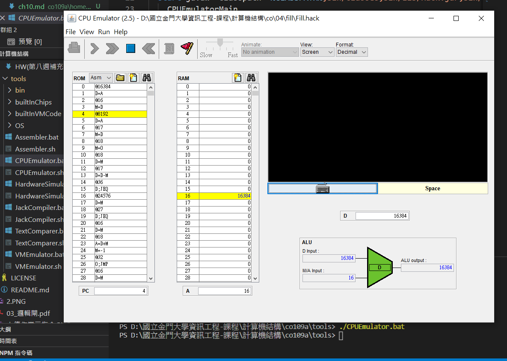

# Fill
## CODE
```
// This file is part of www.nand2tetris.org
// and the book "The Elements of Computing Systems"
// by Nisan and Schocken, MIT Press.
// File name: projects/04/Fill.asm

// Runs an infinite loop that listens to the keyboard input. 
// When a key is pressed (any key), the program blackens the screen,
// i.e. writes "black" in every pixel. When no key is pressed, the
// program clears the screen, i.e. writes "white" in every pixel.

// Put your code here.
 * 老師寫的Ｃ語言的高階寫法範例

// --------------------------
//
// forever
//   arr = SCREEN
//   n = 8192
//   i = 0
//   while (i < n) {
//     if (*KBD != 0)
//       arr[i] = -1
//     else
//       arr[i] = 0
//     i = i + 1
//   }
// goto forever;
// --------------------------
* 老師寫的類似Ｃ語言的低階寫法範例
// 
// arr = SCREEN
// n=8192
// FOREVER:
// loop:
//   if (i==n) goto ENDLOOP
//   if (*KBD != 0)
//     RAM[arr+i] = -1
//   else 
//     RAM[arr+i] = 0
//   i++
// goto loop
// ENDLOOP:
// goto FOREVER
// --------------------------

(FOREVER)
// arr = SCREEN
	@SCREEN
	D=A
	@arr
	M=D

// n=8192
	@8192
	D=A
	@n
	M=D
// i = 0
	@i
	M=0
(LOOP)
  // if (i==n) goto ENDLOOP
	@i
	D=M
	@n
	D=D-M
	@ENDLOOP
	D; JEQ
	
  // if (*KBD != 0)
	@KBD
	D=M     // D = *KBD
	@ELSE
	D; JEQ  // if (*KDB==0) goto ELSE
	
	//   RAM[arr+i] = -1
	@arr
	D=M
	@i
	A=D+M
	M=-1
	
	@ENDIF
	0; JMP
(ELSE)	
  // else 
  //   RAM[arr+i] = 0
	@arr
	D=M
	@i
	A=D+M
	M=0
	
(ENDIF)
	
	// i++
	@i
	M=M+1
	
	@LOOP
	0; JMP

(ENDLOOP)
	@FOREVER
	0; JMP
	
```

## 補充
1. 屏幕 = 256*512(pixel) => 16384
   (由上到下,由左往右,1=black ,0=white)
2. 鍵盤 =>24576

>在CPUEmulator.bat工具中運行黑客程序

> 如果沒有鍵盤輸入（R24576 == 0），則屏幕顏色為白色

>如果有鍵盤輸入（R24576！= 0），請將屏幕顏色更改為黑色
##  Fill hack


## RESULT
