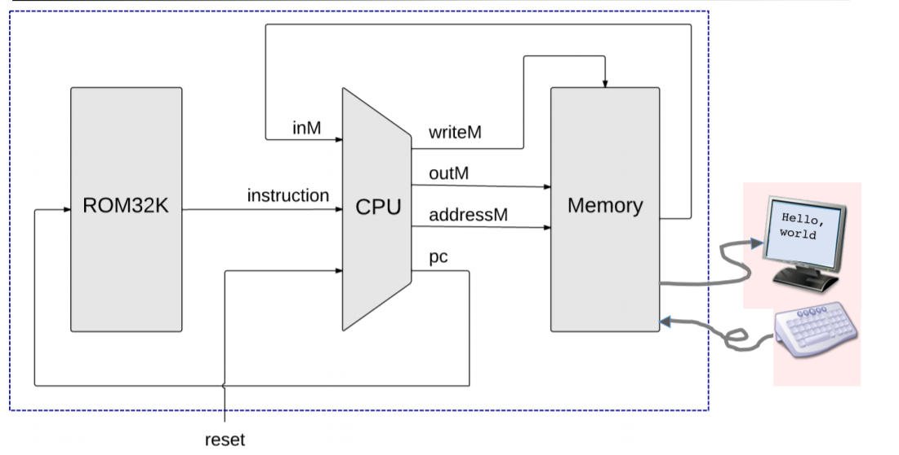

## Computer
* 有多個tst要一個一個試
* [computer.hdl](https://github.com/Yongsin0/co109a/blob/master/05/Computer.hdl)
* [ComputerAdd.tst](https://github.com/Yongsin0/co109a/blob/master/05/ComputerAdd.tst)
* [ComputerAdd-external.tst](https://github.com/Yongsin0/co109a/blob/master/05/ComputerAdd-external.tst)
* [ComputerMax.tst](https://github.com/Yongsin0/co109a/blob/master/05/ComputerMax.tst)
* [ComputerMax-external.tst](https://github.com/Yongsin0/co109a/blob/master/05/ComputerMax-external.tst)
* [ComputerRect.tst](https://github.com/Yongsin0/co109a/blob/master/05/ComputerRect.tst)
* [ComputerRect-external.tst](https://github.com/Yongsin0/co109a/blob/master/05/ComputerRect-external.tst)

# code
```
// This file is part of www.nand2tetris.org
// and the book "The Elements of Computing Systems"
// by Nisan and Schocken, MIT Press.
// File name: projects/05/Computer.hdl

/**
 * The HACK computer, including CPU, ROM and RAM.
 * When reset is 0, the program stored in the computer's ROM executes.
 * When reset is 1, the execution of the program restarts. 
 * Thus, to start a program's execution, reset must be pushed "up" (1)
 * and "down" (0). From this point onward the user is at the mercy of 
 * the software. In particular, depending on the program's code, the 
 * screen may show some output and the user may be able to interact 
 * with the computer via the keyboard.
 */

CHIP Computer {

    IN reset;

    PARTS:
    // Put your code here:
    ROM32K(address=pc, out=instruction);
    CPU(inM=outM, instruction=instruction, reset=reset, outM=inM, writeM=loadM, addressM=addressM, pc=pc);
    Memory(in=inM, load=loadM, address=addressM, out=outM);
}
```
* picture

## 補充
• The Hack Instruction Memory is realized by a built-in chip named ROM32K
• ROM32K: a read-only, 16-bit, 32K RAM chip + program loading side-effect.