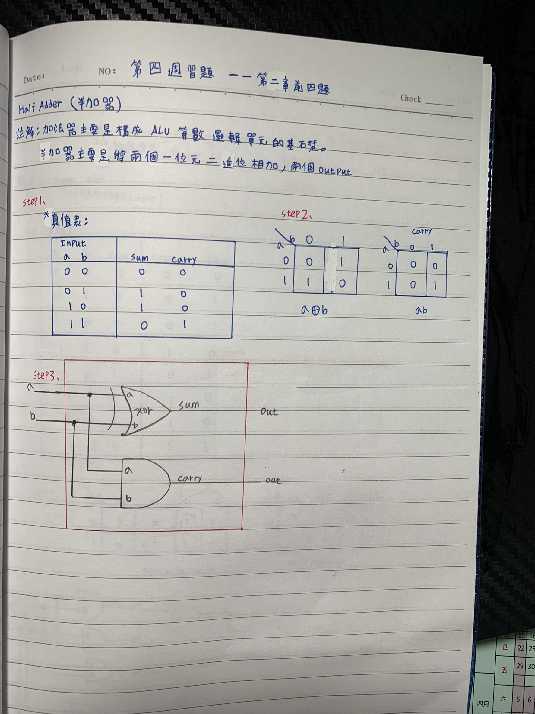
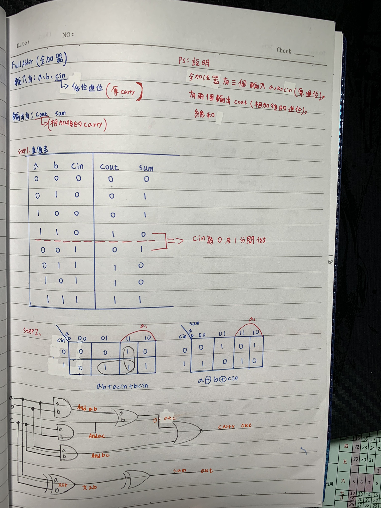
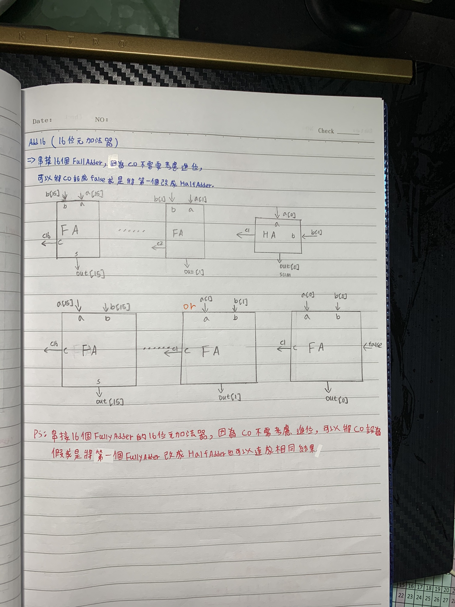
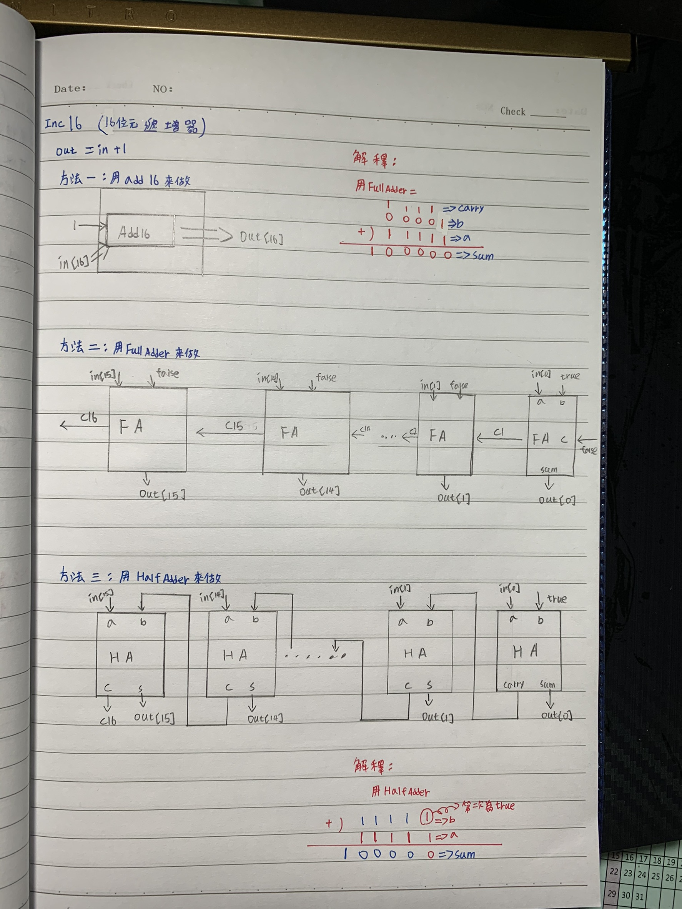

### 1.HalfAdder 
* picture
  
 
* Explanation
>* 加法器主要是構成ALU(算術邏輯單元的基礎)，半加器主要是將兩個一位元二進位相加，有兩個OUTPUT

* code
```
// This file is part of www.nand2tetris.org
// and the book "The Elements of Computing Systems"
// by Nisan and Schocken, MIT Press.
// File name: projects/02/HalfAdder.hdl

/**
 * Computes the sum of two bits.
 */

CHIP HalfAdder {
    IN a, b;    // 1-bit inputs
    OUT sum,    // Right bit of a + b 
        carry;  // Left bit of a + b

    PARTS:
    // Put you code here:
    Xor(a=a,b=b,out=sum);
    And(a=a,b=b,out=carry);
}

```
### 2.FullAdder
* picture
 
 
* Explanation
>* 全加法器有三個輸入a,b,cin(原carry)，有兩個輸出cout(相加後的carry),sum

* code
```
// This file is part of www.nand2tetris.org
// and the book "The Elements of Computing Systems"
// by Nisan and Schocken, MIT Press.
// File name: projects/02/FullAdder.hdl

/**
 * Computes the sum of three bits.
 */

CHIP FullAdder {
    IN a, b, c;  // 1-bit inputs
    OUT sum,     // Right bit of a + b + c
        carry;   // Left bit of a + b + c

    PARTS:
    // Put you code here:
    And(a=a,b=b,out=Andab);
    And(a=a,b=c,out=Andac);
    And(a=b,b=c,out=Andbc);
    Or(a=Andab,b=Andac,out=Orabac);
    Or(a=Orabac,b=Andbc,out=carry);
    Xor(a=a,b=b,out=Xab);
    Xor(a=Xab,b=c,out=sum);
}

```
### 3.Add16
* picture
  
 
* Explanation
>* 串接16個FullyAdder的十六位元加法器，因為C0不需考慮進位，可以將C0設為false或是將第一個FullyAdder改成HalfAdder也可以達成相同的結果

* code
```
// This file is part of www.nand2tetris.org
// and the book "The Elements of Computing Systems"
// by Nisan and Schocken, MIT Press.
// File name: projects/02/Adder16.hdl

/**
 * Adds two 16-bit values.
 * The most significant carry bit is ignored.
 */

CHIP Add16 {
    IN a[16], b[16];
    OUT out[16];

    PARTS:
   // Put you code here:
   FullAdder(a=a[0],b=b[0],c=false,sum=out[0],carry=c1);
   //HalfAdder(a=a[0],b=b[0],sum=out[0],carry=c1);
   FullAdder(a=a[1],b=b[1],c=c1,sum=out[1],carry=c2);
   FullAdder(a=a[2],b=b[2],c=c2,sum=out[2],carry=c3);
   FullAdder(a=a[3],b=b[3],c=c3,sum=out[3],carry=c4);
   FullAdder(a=a[4],b=b[4],c=c4,sum=out[4],carry=c5);
   FullAdder(a=a[5],b=b[5],c=c5,sum=out[5],carry=c6);
   FullAdder(a=a[6],b=b[6],c=c6,sum=out[6],carry=c7);
   FullAdder(a=a[7],b=b[7],c=c7,sum=out[7],carry=c8);
   FullAdder(a=a[8],b=b[8],c=c8,sum=out[8],carry=c9);
   FullAdder(a=a[9],b=b[9],c=c9,sum=out[9],carry=c10);
   FullAdder(a=a[10],b=b[10],c=c10,sum=out[10],carry=c11);
   FullAdder(a=a[11],b=b[11],c=c11,sum=out[11],carry=c12);
   FullAdder(a=a[12],b=b[12],c=c12,sum=out[12],carry=c13);
   FullAdder(a=a[13],b=b[13],c=c13,sum=out[13],carry=c14);
   FullAdder(a=a[14],b=b[14],c=c14,sum=out[14],carry=c15);
   FullAdder(a=a[15],b=b[15],c=c15,sum=out[15],carry=c16);
}

```
### Inc16
* picture


* Explanation
>* 這是一個16位元的遞增器，及類似於Add16我共寫了三中寫法及圖示在我的程式碼及圖片中，分別是Add16,FullAdder和HalfAdder

* code
```
// This file is part of www.nand2tetris.org
// and the book "The Elements of Computing Systems"
// by Nisan and Schocken, MIT Press.
// File name: projects/02/Inc16.hdl

/**
 * 16-bit incrementer:
 * out = in + 1 (arithmetic addition)
 */

CHIP Inc16 {
    IN in[16];
    OUT out[16];

    PARTS:
   // Put you code here:
   //方法一:用Add16
   Add16(a=in,b[0]=true,b[1..15]=false,out=out);

   //方法二:用全加器
   /*FullAdder(a=in[0],b=true,c=false,sum=out[0],carry=c1); 
   FullAdder(a=in[1],b=false,c=c1,sum=out[1],carry=c2);
   FullAdder(a=in[2],b=false,c=c2,sum=out[2],carry=c3);
   FullAdder(a=in[3],b=false,c=c3,sum=out[3],carry=c4);
   FullAdder(a=in[4],b=false,c=c4,sum=out[4],carry=c5);
   FullAdder(a=in[5],b=false,c=c5,sum=out[5],carry=c6);
   FullAdder(a=in[6],b=false,c=c6,sum=out[6],carry=c7);
   FullAdder(a=in[7],b=false,c=c7,sum=out[7],carry=c8);
   FullAdder(a=in[8],b=false,c=c8,sum=out[8],carry=c9);
   FullAdder(a=in[9],b=false,c=c9,sum=out[9],carry=c10);
   FullAdder(a=in[10],b=false,c=c10,sum=out[10],carry=c11);
   FullAdder(a=in[11],b=false,c=c11,sum=out[11],carry=c12);
   FullAdder(a=in[12],b=false,c=c12,sum=out[12],carry=c13);
   FullAdder(a=in[13],b=false,c=c13,sum=out[13],carry=c14);
   FullAdder(a=in[14],b=false,c=c14,sum=out[14],carry=c15);
   FullAdder(a=in[15],b=false,c=c15,sum=out[15],carry=c16);*/

   //方法三:用半加器 
   /*HalfAdder(a=in[0],b=true,sum=out[0],carry=c1);
   HalfAdder(a=in[1],b=c1,sum=out[1],carry=c2);
   HalfAdder(a=in[2],b=c2,sum=out[2],carry=c3);
   HalfAdder(a=in[3],b=c3,sum=out[3],carry=c4);
   HalfAdder(a=in[4],b=c4,sum=out[4],carry=c5);
   HalfAdder(a=in[5],b=c5,sum=out[5],carry=c6);
   HalfAdder(a=in[6],b=c6,sum=out[6],carry=c7);
   HalfAdder(a=in[7],b=c7,sum=out[7],carry=c8);
   HalfAdder(a=in[8],b=c8,sum=out[8],carry=c9);
   HalfAdder(a=in[9],b=c9,sum=out[9],carry=c10);
   HalfAdder(a=in[10],b=c10,sum=out[10],carry=c11);
   HalfAdder(a=in[11],b=c11,sum=out[11],carry=c12);
   HalfAdder(a=in[12],b=c12,sum=out[12],carry=c13);
   HalfAdder(a=in[13],b=c13,sum=out[13],carry=c14);
   HalfAdder(a=in[14],b=c14,sum=out[14],carry=c15);
   HalfAdder(a=in[15],b=c15,sum=out[15],carry=c16);*/
}
```
