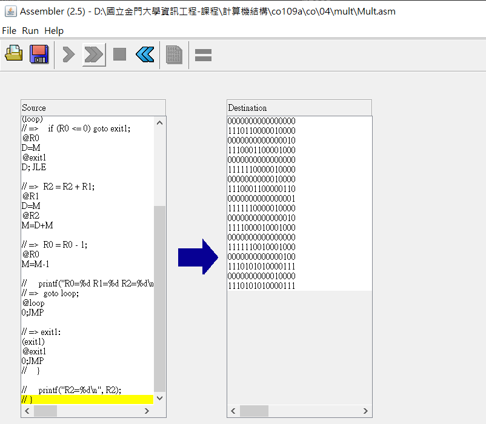
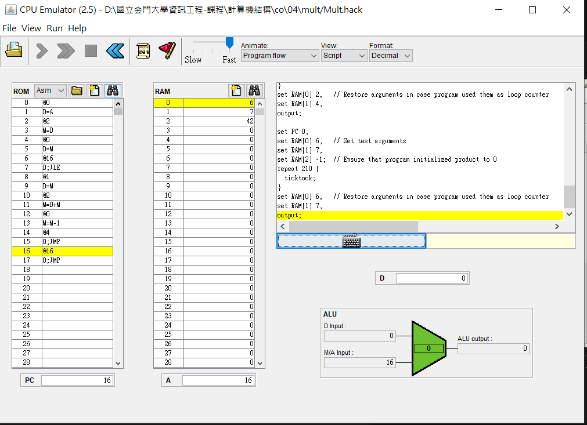

## mult.asm
>* Step1:先把程式寫成C語言，並執行他
>* Step2:再改成C的組合語言的語法(組合語言只有if ,goto ,和一些標籤語言(e.g LOOP:,EXIT:...))
>* Stap3:再來就可以開始使用組合語言將C語言一行一行的轉換

* 首先是老師寫的C範例
```
#include <stdio.h>

int main() {
    int R0 = 3;
    int R1 = 5;
    int R2 = 0;
    
//    while (R0 > 0) {
loop:
    if (R0 <= 0) goto exit1;
    R2 = R2 + R1;
    R0 = R0 - 1;
    printf("R0=%d R1=%d R2=%d\n", R0, R1, R2);
    goto loop;
exit1:
//    }
    
    printf("R2=%d\n", R2);//顯示結果
}

```
* 接者是老師寫的mult.asm範例
```
// #include <stdio.h>

// int main() {
//    int R0 = 3;
//    int R1 = 5;
// =>    int R2 = 0;
@0 //a設為0
D=A  //d=0
@R2 //a設為2
M=D //m[2]=d
//    while (R0 > 0) {
// => loop:
(loop)
// =>    if (R0 <= 0) goto exit1;
@R0
D=M  //d= m[0]
@exit1 //把a設為exit1
D; JLE //d<=0就goto exit1

// =>  R2 = R2 + R1;
@R1 //a=1
D=M  d=m[1]
@R2 //a=2
M=D+M //m2=d+m2

// =>  R0 = R0 - 1;
@R0
M=M-1 //計數器-1

//     printf("R0=%d R1=%d R2=%d\n", R0, R1, R2);
// =>  goto loop;
@loop
0;JMP //回到LOOP1

// => exit1:
(exit1)
@exit1
0;JMP
//    }
    
//     printf("R2=%d\n", R2);
// }

```




## RESULT


## 補充(常用指令)
1. @ : memory位置
2. A : A暫存器
3. D : D暫存器
4. M : 當前memory之值
5. NULL: NO JUMP
6. JGT: IF OUT>0 ,JUMP
7. JNE: IF OUT!=0 ,JUMP
8. JMP: JUMP
9 .JEQ: IF OUT=0 ,JUMP
## 操作步驟
1. 寫mult.asm的code
2. 使用Assembler.bat進行轉換
3. 開啟CPUEmulator.bat
4. load program------>mult.hack
5. load script ------>mult.tst
6. run and finish

